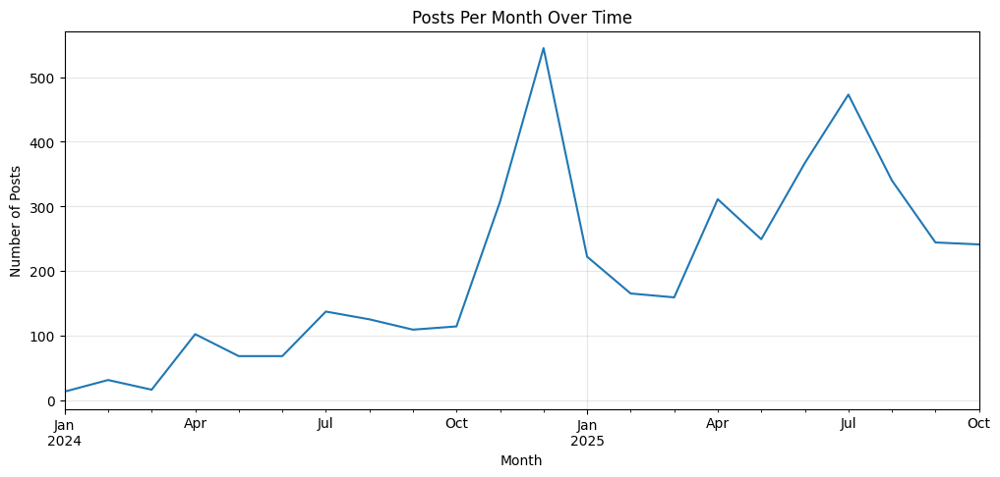

# Periospot Social: Predicting High-Performance Posts (Binary Classification)

**Goal**  
Given only features known *before publishing* (network, post type, content type, account, posting time, caption length, etc.), predict whether a post will be a **High Performer** (threshold chosen *empirically during EDA*).

**Why it matters**  
This enables proactive content planning: schedule, format, and creative choices that raise the odds of high engagement.

## Dataset

- Source: Sprout Social exports (5+ years)
- Files:
  - `data/raw/post_performance.csv`
  - `data/raw/profile_performance.csv`

## Methods

- EDA → choose a defensible high/low threshold from the empirical distribution.
- Feature engineering (pre-posting only; strict anti-leakage).
- Models: Logistic (baseline), RandomForest, XGBoost (tuned).
- Validation: **temporal split** (train ≤2024-12, test ≥2025-01) to simulate out-of-time generalization.
- Metrics: ROC-AUC, PR-AUC, Recall/Precision, business-focused threshold tuning (maximize recall at acceptable precision).

## Data Exploration Findings

### Dataset Overview
- **Total posts:** 8,434 (October 2020 - October 2025)
- **Networks:** X/Twitter (67% - dominant), Threads, Instagram, Facebook, LinkedIn, TikTok, YouTube, Pinterest
- **Post Types:** Regular posts, Stories, Reels, Replies, Quotes, Pins

### Target Variable: Engagement Rate (per Impression)

**Coverage by Year:**
- 2020-2022: <2% (metric not available in Sprout exports)
- 2023: 35% (partial rollout)
- **2024-2025: 96-98% coverage** ✅ *← Usable data*

**Coverage by Network:**
- Full coverage (100%): Facebook, TikTok, Threads
- Good coverage (78%): Instagram
- Partial coverage (45%): X/Twitter
- No coverage (~0%): Pinterest, YouTube, LinkedIn

### Key Decisions

#### Data Filtering
**Decision:** Use only 2024-2025 data where target is reliably available  
**Rationale:** Target variable only present in 96-98% of posts from these years  
**Result:** 4,406 usable posts with valid engagement rates

#### Train/Test Strategy Challenge
**Problem discovered:** Posting frequency increased dramatically over time
- 2024: 1,635 posts (early/sparse posting)
- 2025: 2,771 posts (high-frequency posting period)
- Inverted ratio: 37% train / 63% test (unusual!)

*Posts per month (2024-2025): Clear increase in posting frequency over time, explaining the inverted train/test ratio*

**Decision:** Use all 2024 for training, early 2025 for validation, rest for test
- Training: All 2024 data (1,635 posts)
- Validation: 2025 Jan-Feb (temporal validation)
- Test: 2025 Mar-Oct (holdout set)
- Maintains strict temporal ordering (no data leakage)

#### Network Imbalance Strategy
- X/Twitter dominates: 3,021 posts (67%)
- Other networks: 1,514 posts (33%)
- Plan: Monitor per-network performance in evaluation; consider stratified analysis

### Pre-Posting Features (No Leakage)
Features known BEFORE publishing:
- `Date` → time features (hour, weekday, month, season, year, is_weekend)
- `Network` → platform (categorical: X, Instagram, Threads, etc.)
- `Post Type` → content format (categorical: Post, Story, Reel, etc.)
- `Content Type` → topic category (categorical)
- `Profile` → account identifier (categorical)
- `Post` → caption text → NLP features: length, word count, hashtag count, mention count, URL count
- `Link` → has external link (binary feature)

**Excluded (post-outcome - would leak):**
- Impressions, Reach, Engagements, Clicks, Views, Saves, Shares, Reactions, etc.

### Data Quality Notes
- **Missing captions:** 2.7% of posts (mostly Stories and image-only posts on Instagram/Threads) - expected behavior
- **Zero-impression posts:** Minimal overlap with missing engagement rates - data quality is good

### Data Cleaning & Threshold Selection ✅

**Minimum Impression Filter:**
- **Decision:** Filter out posts with <20 impressions
- **Rationale:** Low-impression posts (1-19) have unreliable engagement rates (e.g., 1 impression + 1 engagement = 100% but not statistically meaningful)
- **Impact:** Removed 395 posts (9.5%), retained 3,745 posts with ≥20 impressions

**Binary Threshold Selection:**
- **Decision:** 90th percentile = **7.14% engagement rate**
- **Rationale:** Focus on exceptional posts (not just above-average). Meaningful difference from 80th percentile (4.62%) - represents 54% improvement in engagement
- **Class Distribution:**
  - High Performers (label=1): 378 posts (10.1%) - engagement ≥7.14%
  - Regular Posts (label=0): 3,367 posts (89.9%) - engagement <7.14%
- **Imbalance Strategy:** 90/10 split is moderate and manageable with class weights in tree models

**Final Clean Dataset:**
- 3,745 posts (2024-2025)
- ≥20 impressions per post
- Valid engagement rate target
- Binary labels created
- Ready for feature engineering

### Next Steps
- [ ] Feature engineering: time features, text features, categorical encoding
- [ ] Temporal train/validation/test split implementation (2024 train, early 2025 val, rest test)
- [ ] Baseline models (Logistic Regression, majority class)
- [ ] Tree ensembles (RandomForest, XGBoost with class weights for imbalance)
- [ ] Evaluation with proper imbalanced metrics (ROC-AUC, PR-AUC, not just accuracy)
- [ ] SHAP analysis for feature importance and interpretability
- [ ] Per-network robustness checks

---

## Repro

1. `python -m venv .venv && source .venv/bin/activate` (or use Conda)
2. `pip install -r requirements.txt`
3. Open `notebooks/01_post_performance_binary.ipynb` and run cells top-to-bottom.

